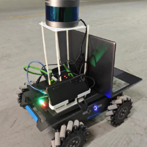

# AMR

Autonomous Mobile Robot for wall crack detection





底盘为[mark-2麦克纳姆轮车](https://item.taobao.com/item.htm?spm=a1z2k.11010449.931864.2.1b33509dDAVV8C&scm=1007.13982.82927.0&id=668385250737&last_time=1689846296)

激光雷达为[robosense-16线激光雷达](https://ic-item.jd.com/10068172648442.html)

相机为[乐视RGB-D三合一深度相机](https://item.taobao.com/item.htm?spm=a21n57.1.0.0.479e523cLAzKoQ&id=724662552352&ns=1&abbucket=0#detail)


支持ros **noetic**和**melodic**版本

**建立工作空间**

```bash
mkdir -p amr_ws/src
cd amr_ws/src
git clone --recursive https://gitee.com/gu-taiyang/amr.git
cd ..
catkin_make -j1
```

**目标检测**（运用yolov5模型识别墙体裂缝）

```bash
chmod +x Yolo.py
roslaunch ros_astra_camera astra.launch
rosrun detect Yolo
```

**雷达建图**（运用LeGO-LOAM定位建图）

```bash
roslaunch rslidar_pointcloud rs_lidar_16.launch
roslaunch lego_loam test.launch
roslaunch octomap_server octomap_server.launch
```

**路径规划**（运用CCPP进行全局路径规划，A*+DWA进行动态路径规划）

```bash
roslaunch clean_robot test.launch
```


